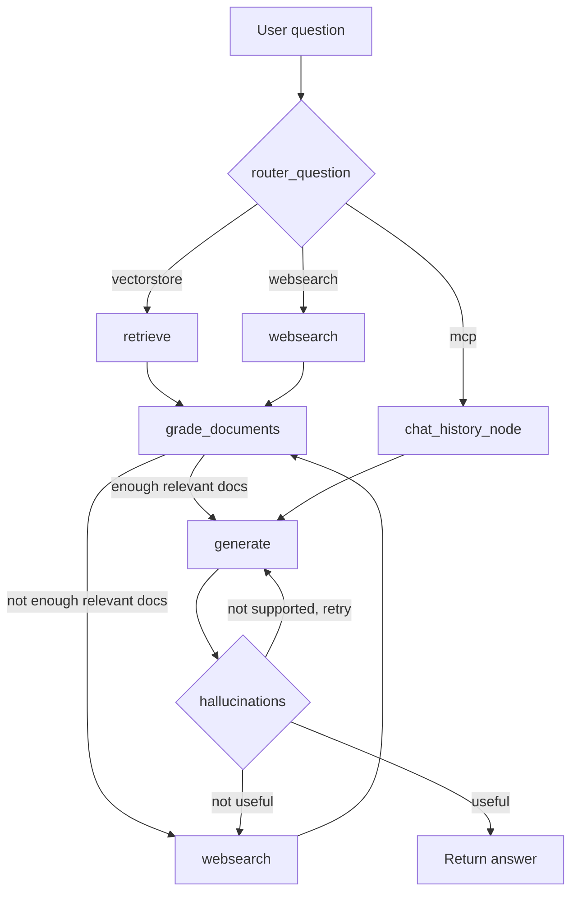

# AgentFlow — AI Agent Platform with RAG and LangGraph

A FastAPI backend that answers chat messages using an adaptive **LangGraph** agent. The agent routes each question to a knowledge-base retriever (RAG over Chroma), a live web search (Tavily), or the user's own chat history (via an MCP tool), grades the retrieved evidence, generates an answer, and checks the answer for hallucinations before returning it.

## How it works



1. **Router** — an LLM classifies the question as needing the vector store, a web search, or the user's chat history (MCP).
2. **Retrieve / Websearch / MCP** — fetches candidate documents, live search results, or the user's past conversations from the database.
3. **Grade documents** — an LLM grades each retrieved document as relevant or not; if the retrieved set is weak, it falls back to web search (bounded by `MAX_WEBSEARCH_RETRIES`).
4. **Generate** — an LLM produces an answer grounded in the collected context.
5. **Hallucination / answer grading** — checks the answer is grounded in the context and actually addresses the question, retrying generation (bounded by `retry_count`) if not.

## Tech stack

- **API**: FastAPI, SQLAlchemy, MySQL, Alembic migrations, JWT auth (`python-jose`)
- **Agent**: LangGraph, LangChain
- **LLMs / embeddings**: Ollama (`qwen3:1.7b` for chat, `nomic-embed-text` for embeddings)
- **Retrieval**: Chroma vector store, Tavily web search
- **Chat history tool**: an MCP tool (`graph/mcp/mcp_api.py`) exposed to the agent for reading a user's own conversations

## Project structure

```
app/                  FastAPI app: auth, chats, models, DB session
  router/              auth.py (register/login/JWT), chats.py (conversations & messages)
  alembic/              DB migrations
graph/                 LangGraph agent
  chains/               router, retriever-relevance grader, generation, hallucination/answer graders
  node/                 graph nodes (retrieve, web_search, grade_documents, generate, hallucinations, chat_history)
  rag/                   ingestion, vector store, retriever
  mcp/                   MCP tool for reading a user's chat history
  graph.py               builds and compiles the LangGraph StateGraph
```

## Setup

### Prerequisites

- Python 3.11+
- [uv](https://docs.astral.sh/uv/) for dependency management
- MySQL server
- [Ollama](https://ollama.com) running locally with the `qwen3:1.7b` and `nomic-embed-text` models pulled:
  ```bash
  ollama pull qwen3:1.7b
  ollama pull nomic-embed-text
  ```
- API keys for Tavily (web search) and, if you swap in a hosted LLM, OpenAI/Google

### Install dependencies

```bash
uv sync
```

### Configure environment

Create a `.env` file in the project root:

```env
# Database
DATABASE_URL=mysql+pymysql://<user>:<password>@localhost:3306
DATABASE_NAME=ai_agent_rag

# Auth (JWT)
SECRET_KEY=<a long random secret>
ALGORITHM=HS256
ISSUER=agent_flow
AUDIENCE=agent_flow

# Search / LLM providers
TAVILY_API_KEY=<your key>
```

### Run database migrations

```bash
uv run alembic -c app/alembic.ini upgrade head
```

### Ingest the knowledge base (optional, for the vectorstore route)

```bash
uv run python -m graph.rag.ingestion
```

### Start the API

```bash
uv run uvicorn app.main:app --reload
```

The API is served at `http://localhost:8000` (interactive docs at `/docs`).

## API overview

- `POST /api/v1/auth/register` — create a user
- `POST /api/v1/auth/login` — log in, returns a bearer JWT
- `GET /api/v1/chats/` — list the authenticated user's conversations
- `POST /api/v1/chats/` — create a conversation
- `GET /api/v1/chats/{id}` — get a conversation with its messages
- `POST /api/v1/chats/{conversation_id}/messages` — send a message; runs it through the LangGraph agent and stores the reply
- `GET /api/v1/chats/{conversation_id}/messages` — list a conversation's messages

All `/api/v1/chats/*` routes require a `Bearer` token from `/api/v1/auth/login`.
